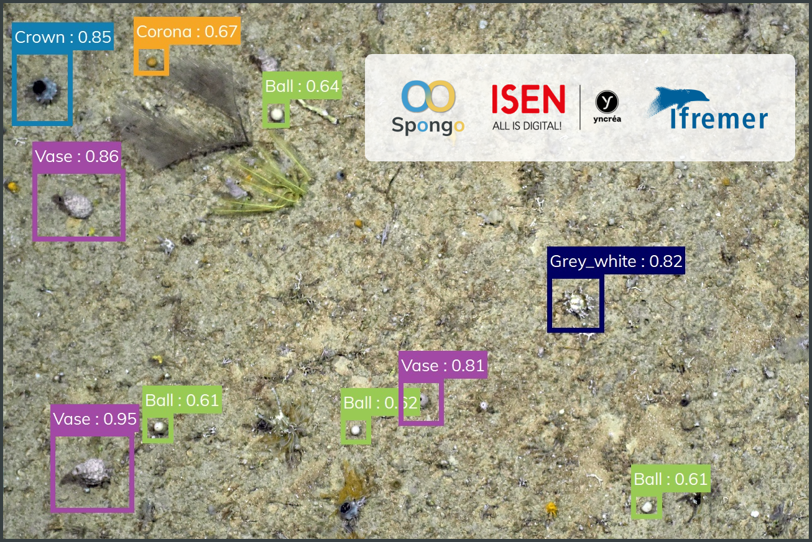
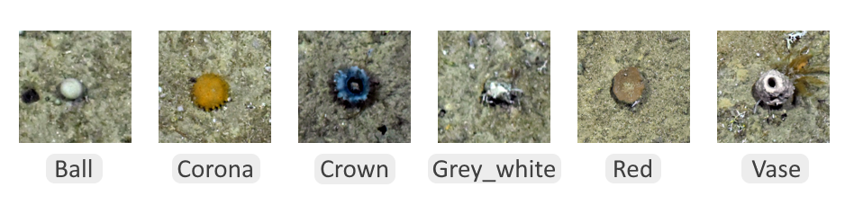

# Spongo - Application for automatic classification of marine sponges

 

## Context
This application was produced by Margaux DOUDET and Alexandre THOMAS as part of an M1 project at ISEN Yncréa Brest in France. This software was developed in collaboration with the Ifremer (French Research Institute for Exploitation of the Sea).

The purpose of this tool is to analyze seabed images. During the analysis, the tool seeks to detect and classify marine sponges of 6 different shapes that we call "morphotypes" : Ball, Vase, Corona, Crown, Red and Grey_white. One example of each is shown on this image below.

 

The classification is made by the neural network YOLOv4 trained on about 250 images of each morphotype. The network was then implemented in the application using the PyTorch library. Finaly, the interface was made with Qt using the PySide2 framework.

To get more information, you can read the [project's report](documents/Rapport%20de%20projet.pdf) (in french).

## Installation instructions
First, we strongly recommand to run this application on a computer with a NVIDIA graphics card. These GPUs allow the software to use the CUDA technology that greatly increases the speed of the application. However, it's still usable without a NVIDIA GPU (it's just 2 to 5 times slower). Also, this application is made for Windows 10. It should work on other environments (like Linux or previous versions of Windows) but we've never tested it.

### From installer (Windows only)
To try the application, you can download the [installer](https://github.com/shell-done/Spongo/releases/download/latest/Spongo_R10_Installer.exe). Nothing more is required ! You can also download [this archive](https://github.com/shell-done/Spongo/releases/download/v1.0/Images_test.zip) that contains 50 images to test the application.

### From sources
The installation from source is useful if you want to modify the application for your own purposes. Our software **should** work on Linux but was only tested on Windows. To install it on your environments, follow these steps :  
  1. Install Python
  2. Clone this repository
  3. Go in the downloaded directory and install the dependencies using the following command : `pip install -r requirements.txt`
  4. Download the [weights' file](https://github.com/shell-done/Spongo/releases/download/latest/yolov4_weights.weights) and place it in `Resources/config/` directory. 
  5. Run `python Main.py` (on Windows) or `python3 Main.py` (on Linux)
  6. That's all !

## User guides
We made two user guides for the Ifremer (in french) :
  - [Installation manual](documents/Application%20Spongo%20-%20Guide%20d'installation.pdf) : How to install and run a simple test on the application
  - [Application manual](documents/Application%20Spongo%20-%20Guide%20de%20l'application.pdf) : Probably the most useful, it explains every features we added in our application

## Reuse and edit this application
This application has been made to be reusable for other purposes, like for example detecting different species of fishes or corals.

To do that, only two files must be changed.
  - In `Resources/config/morphotypes.json`, just remove current classes to add your owns. The 'name' variable is the name of the class, and 'color' is the color it will be associated with in the application.
  - The file `Resources/config/yolov4_weights.weights` is the weights of the network. You must put your own file by training a YOLOv4 neural network on your annotations. To do that, we strongly recommands that you first take a look at this [article](https://towardsdatascience.com/yolov4-in-google-colab-train-your-custom-dataset-traffic-signs-with-ease-3243ca91c81d). Then, you can use our jupyter's notebook (`training/Colab_notebook.ipynb`). All the stuff we used to preprocess data before training the network are in the `training/data_preprocessing/` directory. When your model is trained, copy the weights file and replace `Resources/config/yolov4_weights.weights`.

In theory, nothing else needs to be changed in the code of the application. However, we only handled the application layout for 6 different morphotypes. If you have more classes, you'll probably need to edit the code to fix the layout.

To deploy the application, install pyinstaller using `pip install pyinstaller` then run `pyinstaller Spongo.spec`. It will create a "dist" folder with a .exe file.

## License and reuse
Our code is under [MIT license](LICENSE), that means you can freely download, edit and reuse our application as long as you put out the license file with the project.
